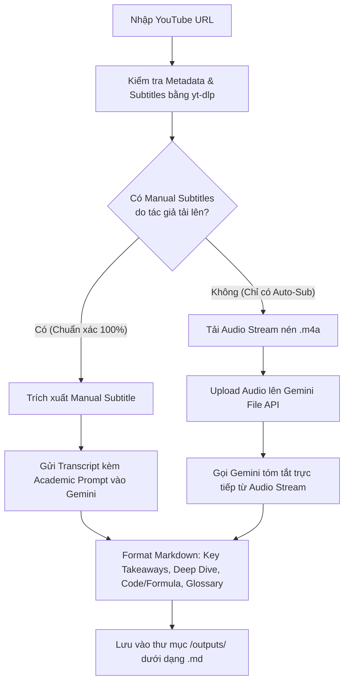

# 📋 KẾ HOẠCH TRIỂN KHAI: HỆ THỐNG TÓM TẮT VIDEO HỌC THUẬT YOUTUBE (ACADEMIC YOUTUBE SUMMARIZER)

> **Mục tiêu**: Xây dựng công cụ tóm tắt video YouTube chuyên sâu (bài giảng, talk kỹ thuật, hội thảo bảo mật/công nghệ) khắc phục triệt để hiện tượng sai lệch thuật ngữ chuyên ngành do Auto-caption của YouTube, bằng cách kết hợp **yt-dlp** và **Gemini Native Audio Understanding (File API)**.

---

## 1. 🔍 Phân Tích Thực Trạng & So Sánh Giải Pháp

### 1.1. Căn nguyên lỗi của các Extension hiện tại
- **Extension thông thường** (như *YouTube Summary with ChatGPT & Claude*): Chỉ cào lớp text phụ đề có sẵn (thường là Auto-generated STT của YouTube).
- **Hạn chế nghiêm trọng đối với nội dung học thuật**:
  - Bị che các từ nhạy cảm / chửi thề hoặc nhận diện sai thành `[ __ ]`.
  - Nuốt âm, mất dấu câu, ngắt câu sai dẫn đến đảo ngược logic câu lệnh/khái niệm.
  - Nhận nhầm các thuật ngữ chuyên ngành (ví dụ: `XSS` thành `excess`, `CSRF` thành `sea surf`, `heap spraying` thành `deep spring`...).
  - **Hệ quả**: "Garbage In, Garbage Out" — Dù dùng model mạnh nhất (GPT-4o, Claude 3.5 Sonnet hay Gemini 3.8), bản tóm tắt vẫn bị sai lệch hoàn toàn về bản chất kỹ thuật.

---

### 1.2. Bảng So Sánh Các Hướng Đi

| Tiêu chí | Cào Auto-Sub + LLM (Extension) | Chạy Local Whisper + LLM | Gemini Native Audio (Đề xuất ⭐) |
| :--- | :--- | :--- | :--- |
| **Độ chính xác thuật ngữ** | ❌ Kém (phụ thuộc sub YouTube) | ✔️ Rất cao (Whisper large-v3) | ⭐ Cực cao (Gemini nghe trực tiếp) |
| **Yêu cầu phần cứng** | Siêu nhẹ | Nặng (GPU VRAM > 6GB, PyTorch) | Siêu nhẹ (Xử lý trên Cloud) |
| **Cài đặt & Phụ thuộc** | Cài extension trình duyệt | Phức tạp (Cần ffmpeg, Torch, C++) | Rất đơn giản (`yt-dlp` + SDK Gemini) |
| **Tốc độ xử lý** | Vài giây | 2 - 10 phút tùy độ dài | 15 - 30 giây cho video 1 tiếng |
| **Chi phí** | Miễn phí | Miễn phí (tốn điện/GPU) | Miễn phí (Free Tier Google AI Studio) |
| **Khả năng hiểu ngữ cảnh** | Chỉ có chữ bị lỗi | Chỉ có chữ (đúng hơn) | Hiểu cả ngữ điệu, nhấn nhá, đa ngôn ngữ |

---

## 2. 🏗️ Kiến Trúc Hệ Thống Đề Xuất (Hybrid Smart Pipeline)

Hệ thống hoạt động theo nguyên lý **"Smart Fallback"**:



### Điểm đột phá kỹ thuật:
1. **Không cần cài đặt FFmpeg phức tạp**: YouTube lưu sẵn các luồng audio DASH định dạng `.m4a` (AAC codec). `yt-dlp` có thể trích xuất trực tiếp stream audio này mà không cần re-encode hay gọi FFmpeg. Dung lượng chỉ khoảng **15 - 30 MB cho 1 video 60 phút**.
2. **Gemini File API hỗ trợ Native Audio**: Đẩy thẳng file `.m4a` lên Google AI Studio. Gemini nghe trực tiếp từng giây của audio, bắt trúng các từ ngữ chuyên ngành tiếng Anh/Việt.
3. **Tiết kiệm tài nguyên tối đa**: Nếu video của các trường đại học lớn (MIT, Stanford) hoặc hội nghị lớn (DEF CON, Black Hat) đã có phụ đề thủ công (Manual CC), hệ thống chỉ tải text (vài KB), không cần tải audio.

---

## 3. 📂 Cấu Trúc Dự Án Trong Thư Mục `Summary_Video`

```
Summary_Video/
├── .env.example              # Mẫu cấu hình API Key (GEMINI_API_KEY)
├── .env                      # File chứa API Key cá nhân (được gitignore)
├── .gitignore                # Bỏ qua file audio tạm và .env
├── requirements.txt          # Các thư viện Python nhẹ (yt-dlp, google-genai, python-dotenv)
├── PLAN.md                   # Bản kế hoạch chi tiết (File này)
├── README.MD                 # Hướng dẫn sử dụng & Kiến trúc tổng quan
├── src/
│   ├── __init__.py
│   ├── config.py             # Quản lý cấu hình & Model settings
│   ├── downloader.py         # Module lấy sub thủ công hoặc tải audio stream .m4a
│   ├── gemini_service.py     # Module upload File API và tương tác với Gemini
│   ├── prompt_templates.py   # Bộ prompt chuyên biệt cho Academic/Tech Summary
│   └── utils.py              # Xử lý lưu file markdown, sanitize tên file
├── outputs/                  # Thư mục chứa các file .md tóm tắt kết quả
└── main.py                   # Điểm khởi chạy CLI (python main.py <URL>)
```

---

## 4. 🗓️ Kế Hoạch Triển Khai Chi Tiết (Roadmap)

### Giai Đoạn 1: Chuẩn Bị & Khởi Tạo Môi Trường
- [x] Tạo tài liệu kiến trúc & kế hoạch (`PLAN.md`).
- [ ] Tạo file cấu hình `requirements.txt` (`yt-dlp`, `google-genai`, `python-dotenv`).
- [ ] Hướng dẫn lấy và thiết lập `GEMINI_API_KEY` từ Google AI Studio (miễn phí).
- [ ] Thiết lập file `.gitignore` để không commit cache, audio tạm, hay API key.

### Giai Đoạn 2: Xây Dựng Core Modules
- [ ] **`src/downloader.py`**:
  - Dùng `yt-dlp` lấy metadata (Title, Channel, Duration, Description).
  - Tự động kiểm tra phụ đề: nếu có phụ đề thủ công (en, vi...) -> tải text `.vtt`/`.srt`.
  - Nếu không có phụ đề thủ công -> tải audio stream định dạng `m4a` tốt nhất dung lượng thấp nhất vào thư mục tạm `temp_audio/`.
- [ ] **`src/gemini_service.py`**:
  - Kết nối với Google Gemini API (dùng SDK mới nhất `google-genai`).
  - Xử lý upload file âm thanh qua File API (tự động xóa file trên cloud sau khi xử lý xong để giữ quota sạch).
  - Gửi request tóm tắt kèm prompt chuyên sâu.

### Giai Đoạn 3: Thiết Kế Bộ Prompt Học Thuật (Academic Prompt Engineering)
- [ ] Xây dựng cấu trúc bản tóm tắt chuẩn hóa:
  1. **Executive Summary (TL;DR)**: Ý tưởng chính gói gọn trong 3-5 gạch đầu dòng.
  2. **Core Concepts & Frameworks**: Các lý thuyết, mô hình, kiến trúc hoặc công thức được đề cập.
  3. **Technical Glossary**: Bảng giải thích các thuật ngữ chuyên ngành xuất hiện trong video kèm ngữ cảnh diễn giả sử dụng.
  4. **Detailed Breakdown with Timestamps**: Tóm tắt từng phần theo mốc thời gian kèm nội dung phân tích chi tiết.
  5. **Critical Analysis & Actionable Takeaways**: Đánh giá ưu/nhược điểm, bài học thực tế, tài liệu tham khảo được diễn giả gợi ý.

### Giai Đoạn 4: CLI Interface & Hoàn Thiện
- [ ] Viết `main.py` nhận tham số dòng lệnh:
  - `python main.py "https://www.youtube.com/watch?v=..."`
  - Tùy chọn `--force-audio`: Luôn ép nghe audio kể cả khi có subtitle.
  - Tùy chọn `--lang vi/en`: Ngôn ngữ xuất bản tóm tắt (mặc định: Tiếng Việt).
- [ ] Lưu kết quả tự động vào `outputs/<Tên_Video>_<Ngày>.md`.

### Giai Đoạn 5: Mở Rộng (Tương Lai)
- [ ] Giao diện WebUI đơn giản bằng Streamlit / Gradio (chỉ cần dán link và bấm nút).
- [ ] Hỗ trợ xuất trực tiếp sang Notion hoặc Obsidian Vault.
